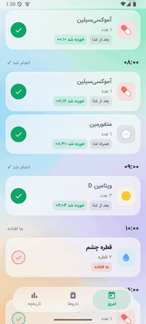
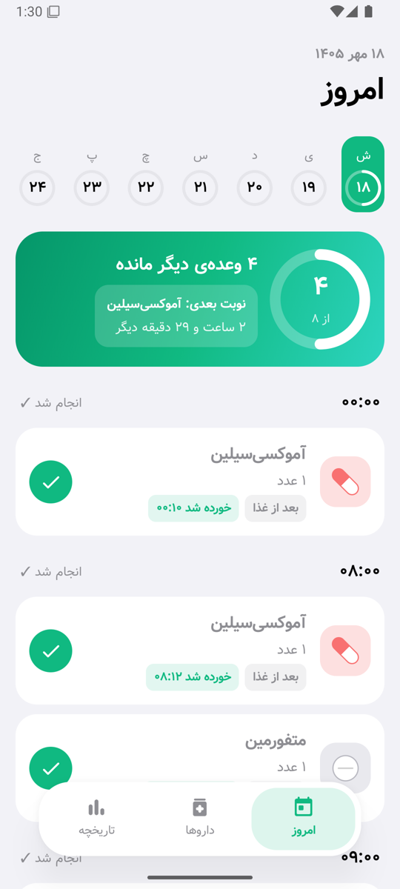
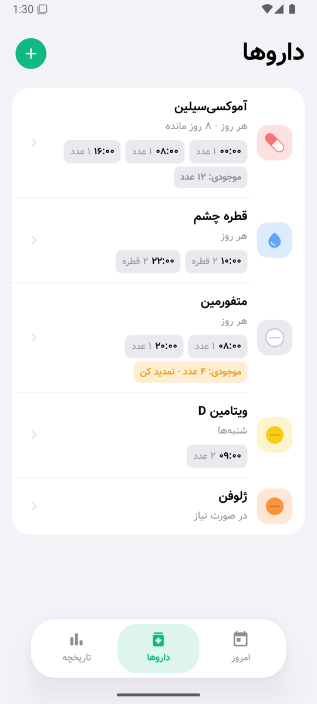
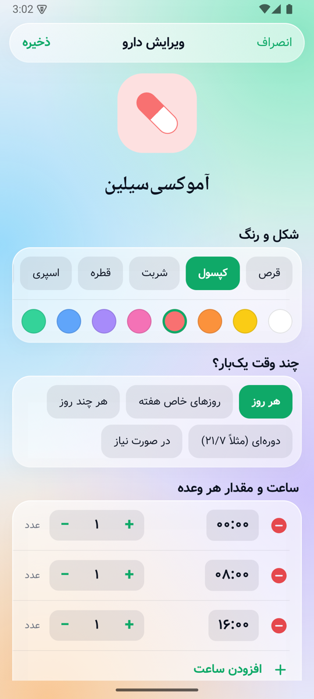
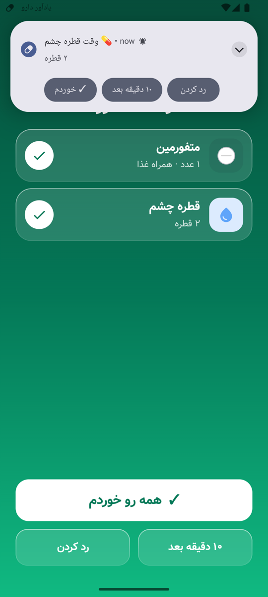
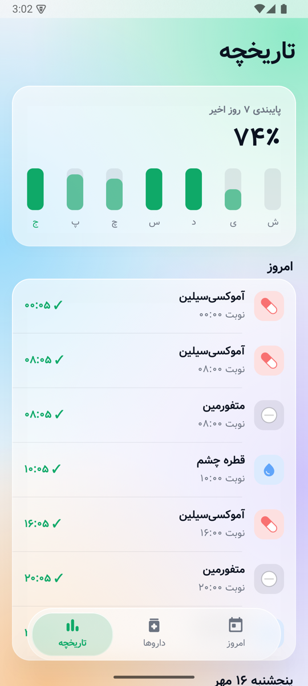
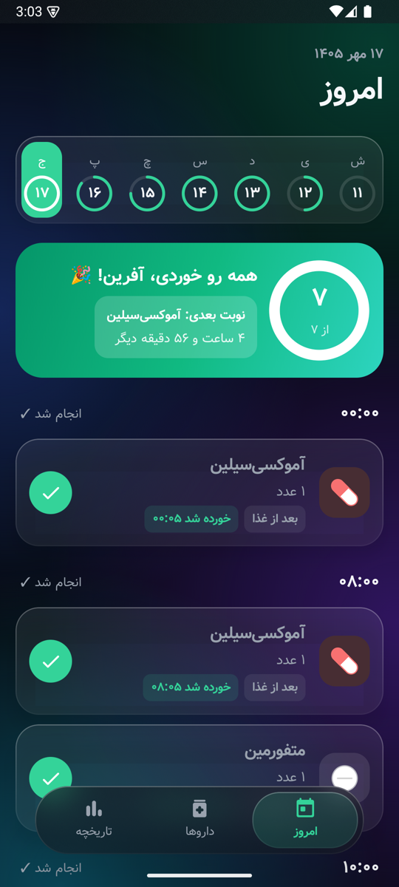

<div align="center">

# یادآور دارو · MedicineReminder

**اپ اندرویدی رایگان و متن‌باز برای اینکه هیچ دارویی جا نیفتد**
فارسی و راست‌به‌چپ · تقویم شمسی · بدون اینترنت، بدون تبلیغ، بدون جمع‌آوری داده

[](https://github.com/Milad1098/MedicineReminder/actions/workflows/android.yml)
[](https://github.com/Milad1098/MedicineReminder/releases)

[](LICENSE)

[English](#english) · [دانلود](#دانلود)



</div>

<p align="center">
  
  
  
</p>
<p align="center">
  
  
  
</p>

## امکانات

- **هر نوع نسخه‌ای**: هر روز، روزهای خاص هفته (مثلاً «۲ عدد، فقط شنبه‌ها»)، هر چند روز، دوره‌ای (۲۱ روز مصرف / ۷ روز استراحت)، در صورت نیاز
- **مقدار در هر وعده**: ۲ عدد، نصف قرص، ۱۰ میلی‌لیتر، ۲ پاف… و چند ساعت در روز با مقدار متفاوت
- **مدت درمان**: مثلاً آنتی‌بیوتیک ۱۰ روزه؛ بعد از آن دارو به آرشیو می‌رود
- **آلارمی که جا نمی‌اندازد**: روی صفحه‌ی قفل، دکمه‌های «خوردم / ۱۰ دقیقه بعد / رد کردن» روی خود نوتیف، و اگر جواب ندهی دوباره یادآوری می‌کند
- **چند دارو هم‌زمان**: اگر دو دارو یک ساعت باشند، صفحه‌ی آلارم هر دو را با هم نشان می‌دهد («همه رو خوردم»)
- **موجودی قرص**: با هر مصرف کم می‌شود و وقت تمدید نسخه خبرت می‌کند
- **صفحه‌ی امروز**: نوار هفته، حلقه‌ی پیشرفت، شمارش معکوس تا نوبت بعدی؛ با یک لمس ثبت کن
- **تاریخچه**: درصد پایبندی ۷ روز اخیر و سابقه‌ی هر وعده (خورده شد / رد شد / جا افتاد)
- **پشتیبان‌گیری**: همه‌چیز در یک فایل؛ با عوض کردن گوشی چیزی از دست نمی‌رود
- **شناخت دارو از ظاهر**: شکل (قرص، کپسول، شربت، قطره، اسپری، آمپول) و رنگ دلخواه
- **دسترس‌پذیر**: سازگار با فونت درشت و TalkBack (هر وعده با نام، مقدار و ساعت خوانده می‌شود)
- طراحی Liquid Glass (به سبک iOS 26)، تم روشن و تیره، فونت وزیرمتن

## دانلود

آخرین APK از بخش [Releases](https://github.com/Milad1098/MedicineReminder/releases) — اندروید ۸ به بالا.

> بعد از نصب، کارت «دسترسی‌ها» در صفحه‌ی امروز را کامل کن (نوتیف، آلارم دقیق، نمایش روی صفحه‌ی قفل). روی شیائومی و سامسونگ بهینه‌سازی باتری را هم برای اپ خاموش کن.

## حریم خصوصی

اپ هیچ دسترسی اینترنتی ندارد؛ اطلاعات فقط روی گوشی خودت می‌ماند. [سیاست حریم خصوصی](PRIVACY.md)

> ⚕️ این برنامه فقط یادآور است و جایگزین توصیه‌ی پزشک یا داروساز نیست.

---

<a name="english"></a>
## English

A free, open-source medication reminder for Android, built for Persian speakers (RTL, Solar Hijri calendar) — fully offline, no ads, no tracking.

**Highlights**
- Flexible schedules: daily, specific weekdays, every N days, on/off cycles (e.g. 21/7), as-needed — plus course duration and per-dose amounts (½ pill, 10 ml, 2 puffs…)
- Reliable alarms: `AlarmManager.setAlarmClock`, full-screen lock-screen alarm, notification actions (taken / snooze / skip), automatic follow-ups, rescheduling after reboot, time-zone change and app update
- Several doses due at once → one alarm screen with "take all"
- Pill stock with refill reminder, adherence history, JSON backup & restore
- Accessibility: large-font safe, TalkBack labels on every dose
- Liquid Glass UI (real backdrop blur on chrome), light & dark

**Tech**
Kotlin · Jetpack Compose (Material 3) · Room (exported schemas, real migrations) · AlarmManager · [Haze](https://github.com/chrisbanes/haze) for backdrop blur · JUnit + Robolectric (in-memory Room) · GitHub Actions CI with signed releases.
No DI framework, no navigation library, no analytics — on purpose; see [docs/DECISIONS.md](docs/DECISIONS.md).

```
domain/   pure-Kotlin scheduling rules (unit-tested)
data/     Room entities, DAO, Repo, Backup
alarm/    scheduler, receivers, notifications, full-screen alarm
ui/       Compose screens, Liquid Glass components, theme
```

More: [Architecture](docs/ARCHITECTURE.md) · [Scheduling rules](docs/SCHEDULING.md) · [Design](docs/DESIGN.md) · [Roadmap](docs/ROADMAP.md)

## Build

Requirements: JDK 17, Android SDK 35.

```bash
./gradlew testDebugUnitTest   # scheduling rules + Repo/backup tests (Robolectric)
./gradlew assembleDebug       # app/build/outputs/apk/debug/app-debug.apk
```

## Contributing

Issues and pull requests are welcome — bug reports from real phones (especially Xiaomi/Samsung battery savers) are the most useful.
Changes to scheduling logic need a test in `ScheduleTest`; data-layer changes a test in `RepoTest`.

## License

[MIT](LICENSE) © Milad

> ⚕️ This app is a reminder only and does not replace advice from a doctor or pharmacist.
